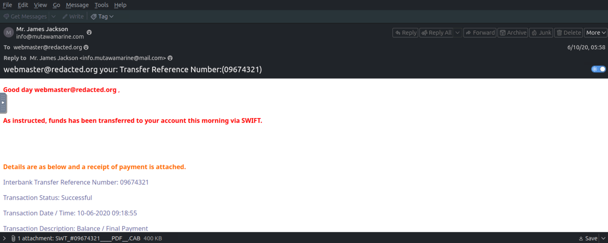
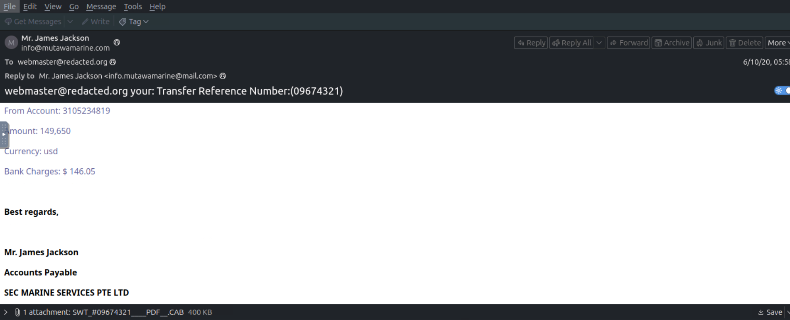
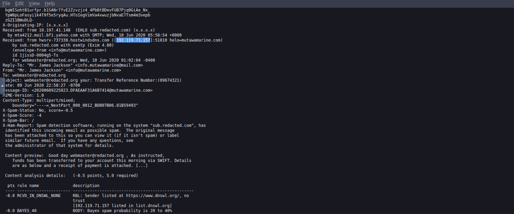
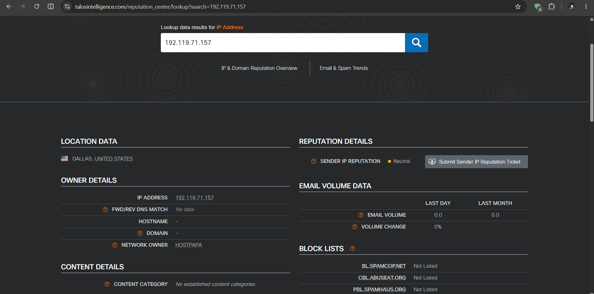
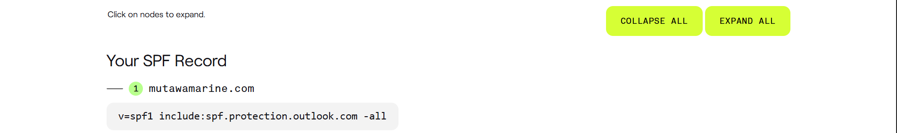
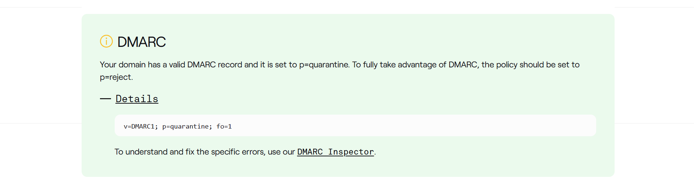
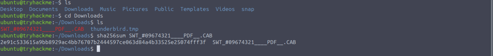
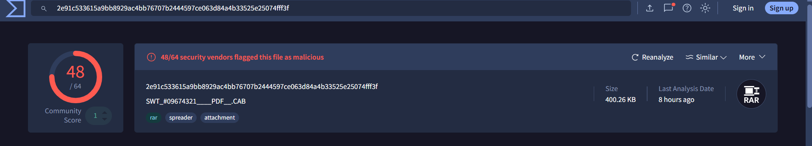
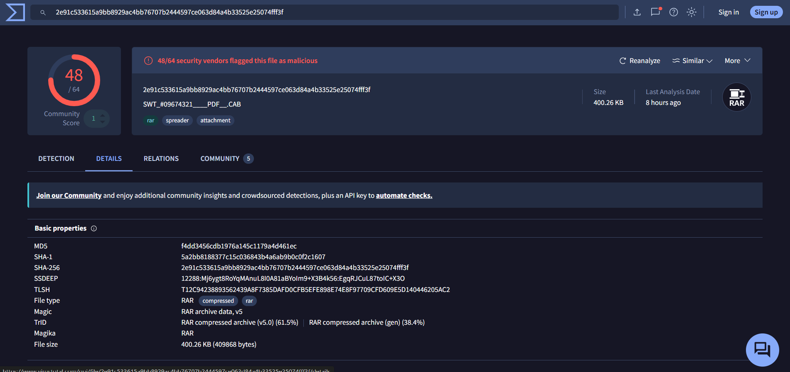

# Greenholt Phish: Phishing Email Investigation

Hands-on lab completed on TryHackMe

## Overview

A sales executive at Greenholt PLC reported a suspicious email from a customer they know. The email had a generic greeting, asked about a money transfer they did not expect, and came with an attachment. The employee said this was not how the customer normally writes, so the email was sent to the security team to check.

In this challenge I analyzed the email to find out who really sent it, whether the sender could be trusted, and whether the attachment was safe. My conclusion is that it is a phishing email with a malicious attachment.

## Tools I used

- **Thunderbird:** to read the email and view its source (headers).
- **Cisco Talos Intelligence:** to look up the sender IP address and its owner.
- **dmarcian SPF Surveyor:** to check the SPF record of the sender domain.
- **dmarcian Domain Checker:** to check the DMARC record of the sender domain.
- **sha256sum (Linux):** to get the hash of the attachment.
- **VirusTotal:** to check the attachment hash and find the real file type.

## Investigation

### 1. Reading the email

I started with what a normal user would see. The subject line contains a transfer reference number (09674321), and the email says funds were "transferred to your account this morning via SWIFT". It gives payment details (about 149,650 USD) and says a receipt is attached. It is signed by "Mr. James Jackson" from Accounts Payable at SEC Marine Services PTE LTD.


*Figure 1: Top part of the email*


*Figure 2: Bottom part of the email with the payment details and signature*

Things that looked wrong to me:

- The greeting uses my email address instead of a name, and the same address is put in the subject line.
- "As instructed" suggests I asked for this payment, but nothing was requested. It pushes the reader to open the receipt.
- The grammar is poor for a message from an accounts department ("funds has been transferred").
- The signature says SEC Marine Services, but the email address is from mutawamarine.com.
- The attachment is called `SWT_#09674321____PDF__.CAB`. It is meant to look like a PDF, but the extension is .CAB.

### 2. Sender details from the headers

Next I opened the email source to read the headers. Here is what I found:

| Item | Value |
|---|---|
| Transfer reference number (subject) | `09674321` |
| Sender display name | `Mr. James Jackson` |
| Sender email address | `info@mutawamarine.com` |
| Reply-To address | `info.mutawamarine@mail.com` |
| Originating IP address | `192.119.71.157` |


*Figure 3: Email source showing the Received headers, Reply-To and the originating IP (highlighted)*

The most important finding here is that the Reply-To address is different from the sender address. The email comes from mutawamarine.com, but if I replied, my answer would go to a mail.com address. This is a common phishing trick, because the attacker gets the reply even if the sender address is fake or gets blocked.

I also noticed that the spam filter on the receiving server marked this email as "not spam" with a score of -0.5 (it needs 5.0 to be marked as spam). So the filter did not catch it, which is why it is important that the employee reported it.

### 3. Who owns the sending IP address?

The originating IP address is `192.119.71.157`. To find its owner I searched it on [Cisco Talos Intelligence](https://talosintelligence.com/).


*Figure 4: Cisco Talos lookup for 192.119.71.157*

Talos shows that the IP is located in Dallas, United States, and that the network owner is **HostPapa**, which is a web hosting company. The sender IP reputation is "Neutral", there is no email volume history, and it is not on the common block lists (SpamCop, CBL, PBL).

This tells me that the IP is not known to be bad yet, but it also does not prove the email is safe. A normal company would usually send email from its own mail servers or from a big provider, not from a small hosting server with no email history.

### 4. SPF record check

SPF is a DNS record that lists which servers are allowed to send email for a domain. I checked the SPF record for mutawamarine.com using the [dmarcian SPF Surveyor](https://dmarcian.com/spf-survey/).


*Figure 5: SPF record for mutawamarine.com*

```
v=spf1 include:spf.protection.outlook.com -all
```

This record says that only Microsoft Outlook (Microsoft 365) servers are allowed to send email for this domain, and the `-all` at the end means every other server should be rejected. The email came from a HostPapa IP address, not from Microsoft, so it does not match the domain's own SPF policy. This means the email was most likely sent by someone who is not the real domain owner.

*Note: the part of the headers I looked at did not show the SPF result from the receiving server, so this conclusion comes from comparing the SPF record with the sending IP.*

### 5. DMARC record check

DMARC tells receiving servers what to do with emails that fail SPF or DKIM checks. I checked it with the [dmarcian Domain Checker](https://dmarcian.com/domain-checker/).


*Figure 6: DMARC record for mutawamarine.com*

```
v=DMARC1; p=quarantine; fo=1
```

The domain has a valid DMARC record with the policy set to quarantine. That means emails that fail the checks should be put in spam. dmarcian recommends `p=reject` for the best protection. In this case the email still reached the inbox, so the protection did not help here.

### 6. The attachment

The attachment is named `SWT_#09674321____PDF__.CAB` and is about 400 KB. I saved it in the lab machine and ran `sha256sum` on it without opening it.


*Figure 7: SHA256 hash of the attachment*

```
2e91c533615a9bb8929ac4bb76707b2444597ce063d84a4b33525e25074fff3f
```

### 7. Checking the hash on VirusTotal

I searched the SHA256 hash on [VirusTotal](https://www.virustotal.com/).


*Figure 8: VirusTotal detection result*


*Figure 9: VirusTotal file details*

48 out of 64 security vendors flagged the file as malicious. The file size is 400.26 KB, and VirusTotal tags it as "rar", "spreader" and "attachment".

The most interesting part is the file type. The name says PDF and the extension says CAB, but the real file type is a **RAR archive**. The name and extension are disguised to make the file look like a normal receipt and to get past simple filters.

## Summary of findings

| Question | Answer |
|---|---|
| Transfer reference number | `09674321` |
| Sender display name | `Mr. James Jackson` |
| Sender email address | `info@mutawamarine.com` |
| Reply-To address | `info.mutawamarine@mail.com` |
| Originating IP address | `192.119.71.157` |
| Owner of the IP | HostPapa |
| SPF record | `v=spf1 include:spf.protection.outlook.com -all` |
| DMARC record | `v=DMARC1; p=quarantine; fo=1` |
| Attachment name | `SWT_#09674321____PDF__.CAB` |
| SHA256 of attachment | `2e91c533615a9bb8929ac4bb76707b2444597ce063d84a4b33525e25074fff3f` |
| Attachment size | 400.26 KB |
| Real file type | RAR |

## Conclusion

This is a phishing email. The reasons are:

- It uses a fake payment notice to get the reader to open an attachment.
- The Reply-To address goes to a different domain than the sender.
- The sending IP is a web hosting server, and it does not match the SPF record of the domain, which only allows Microsoft servers.
- The signature company name does not match the sender domain.
- The attachment pretends to be a PDF, uses a .CAB extension and is really a RAR archive that 48 of 64 vendors detect as malicious.

## What I would recommend

- Block the sender address, the Reply-To address and the IP address, and delete any other copies of this email from mailboxes.
- Search for the attachment hash in email and endpoint logs to see if anyone else received or opened it.
- If anyone opened the attachment, isolate that computer and scan it.
- Block or scan archive attachments (RAR, CAB, ZIP) from outside senders and check the real file type instead of trusting the extension.
- Ask the employee to keep reporting emails like this and remind staff to confirm payment requests by calling the sender on a known number.

## What I learned

- How to read email headers and find the real origin of an email.
- How SPF and DMARC work, and how to compare them with the sending server.
- How to use Cisco Talos, dmarcian and VirusTotal to research an IP, a domain and a file.
- That the file name and extension cannot be trusted, so the hash and file type must be checked.
