# Snapped Phish-ing Line: Phishing Campaign Investigation

Hands-on lab completed on TryHackMe

## Overview

Several employees at SwiftSpend Financial reported a suspicious email on the same day, and some of them had already entered their login details and were locked out of their accounts. I was asked to look into the emails, find out what the attacker was doing, and check how far the attack had gone.

This one went further than a normal phishing email check, because the attacker had left files open on their own website. I was able to follow the phishing link all the way to the fake login page, find the phishing kit the attacker used to build it, and even find a log file with real stolen passwords in it.

## Tools I used

- **Thunderbird:** to read the reported emails
- **Firefox (in the analysis VM):** to open the phishing link and browse the attacker's website
- **VirusTotal:** to check the phishing kit archive
- **sha256sum:** to hash the archive
- **CyberChef:** to decode a hidden flag
- Basic Linux commands to extract and read the phishing kit files

## Investigation

### 1. The first email

The first email was sent to William McClean with the subject "Quote for Services Rendered". It came from Group Marketing Online, with the sender address `Accounts.Payable@groupmarketingonline.icu`, and had a PDF attached. This address turned out to be the one the attacker used for the whole campaign.

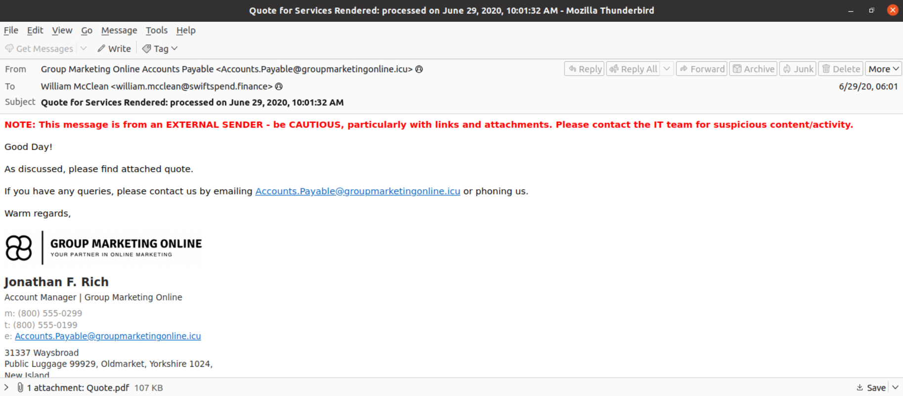
*Figure 1: Email to William McClean from the attacker's address*

### 2. The email to Zoe Duncan

A second email in the same batch was sent to Zoe Duncan and had an HTML attachment. Opening the attachment file showed a link that pointed to `kennaroads.buzz`, which is the root domain of the redirect. Instead of a PDF, this email used an HTML file to send the victim straight to the attacker's phishing site.

### 3. Following the link

I opened the link in the VM's browser to see where it led.

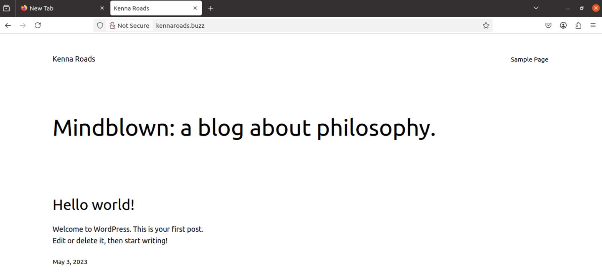
*Figure 2: kennaroads.buzz home page. This is a normal-looking WordPress blog, most likely a legitimate site that the attacker had compromised and was using to host the phishing page*

Following the full redirect link led to a fake Microsoft sign-in page, pre-filled with the victim's email address to make it look real.

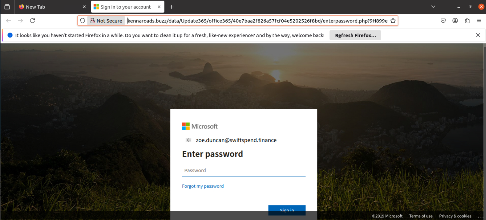
*Figure 3: Fake Microsoft login page hosted on kennaroads.buzz, asking for the victim's password*

### 4. Checking for exposed files

Since the phishing page was hosted on a real website, I checked if the attacker had left the folder structure open to browsing. Going to `kennaroads.buzz/data/` showed a directory listing.

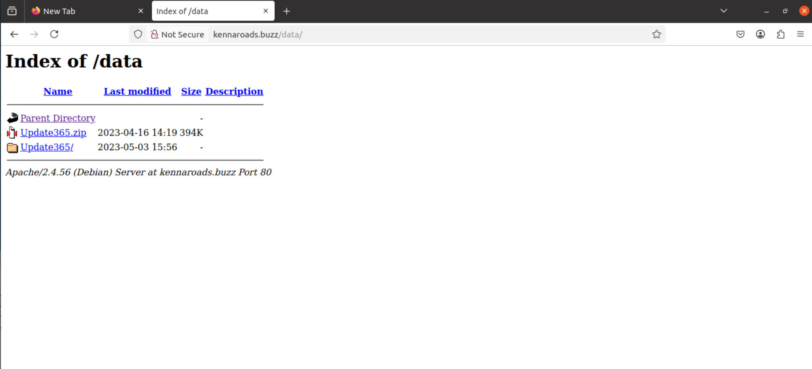
*Figure 4: The `/data` directory was open and showed a file called `Update365.zip`, which is the phishing kit itself*

### 5. Getting the phishing kit

I downloaded `Update365.zip` to the VM and hashed it with `sha256sum` before opening it.

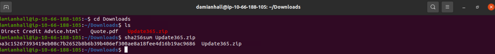
*Figure 5: SHA256 hash of Update365.zip*

```
ba3c15267393419eb08c7b2652b8b6b39b406ef300ae8a18fee4d16b19ac9686
```

### 6. Checking the kit on VirusTotal

I searched the hash on VirusTotal.

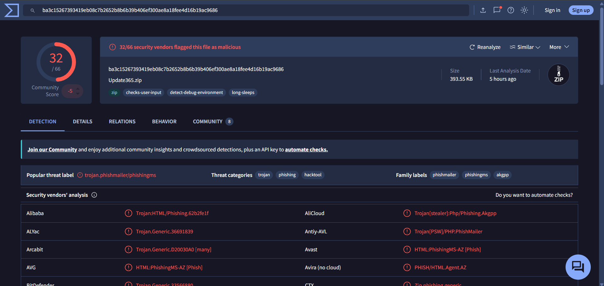
*Figure 6: VirusTotal result: 32 out of 66 vendors flag the file as malicious*

32 of 66 vendors flagged it, and besides phishing it is also tagged as a **trojan**, with labels like `phishmailer`, `phishingms` and `hacktool`. So this is not just a static fake login page, it is a packaged phishing kit that vendors treat as malware.

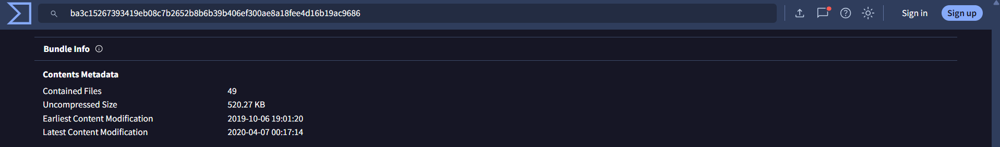
*Figure 7: The archive contains 49 files*

### 7. Reading the exposed log file

Since the whole `/data` folder was open, I also checked `/data/Update365/log.txt`, and the attacker had left the captured credentials sitting there in plain text.

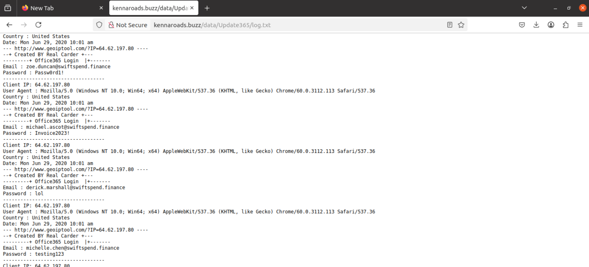
*Figure 8: log.txt showing captured emails and passwords, each with an IP address and timestamp*

I noticed one user, `michael.ascot@swiftspend.finance`, appears more than once in the log, meaning he submitted his credentials on the form more than once.

### 8. Extracting the kit and reading submit.php

I extracted the archive on the VM and went into the kit's folder structure to find the script that handles the stolen credentials.

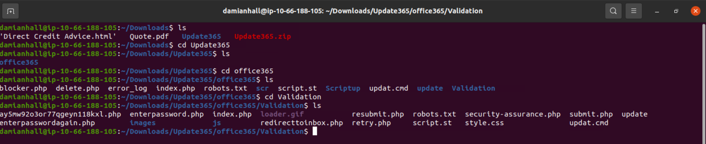
*Figure 9: Extracted Update365 kit, showing the office365/Validation folder with the phishing pages and scripts*

Inside `Validation`, the file `submit.php` builds the message with the stolen email and password, and sends it out.

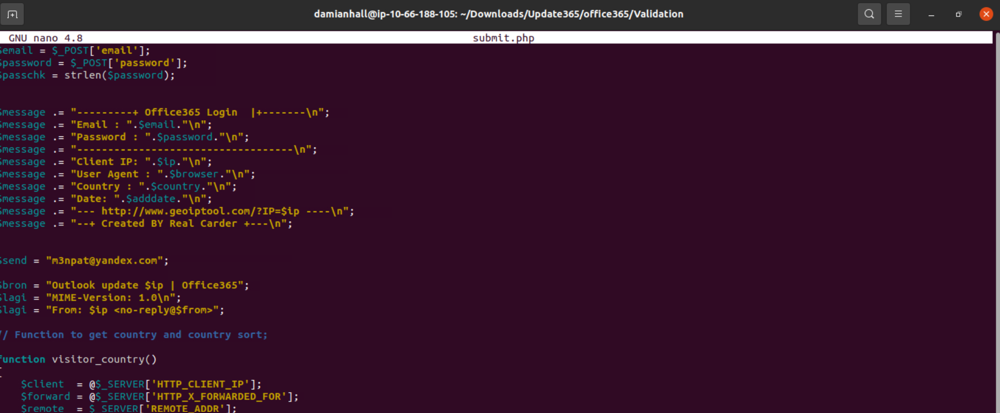
*Figure 10: submit.php collecting the email, password, IP, browser and country, and emailing it out*

The script sends every set of stolen credentials to:

```
m3npat@yandex.com
```

This is the attacker's real collection point. Even if the log file on the server is later cleaned up, every stolen password still goes out by email too.

### 9. Finding the hidden flag

Going back to the website, I found a `flag.txt` file under the same folder as the fake login page.

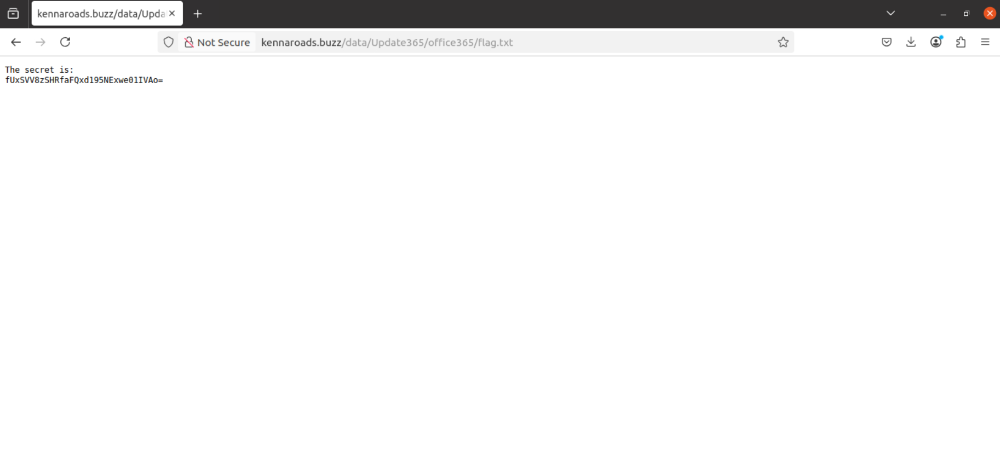
*Figure 11: flag.txt containing a base64-looking string*

```
fUxSVV8zSHRfaFQxd195NExwe01IVAo=
```

I decoded it in the VM terminal, first with base64, then reversed the result, since the string was stored backwards.

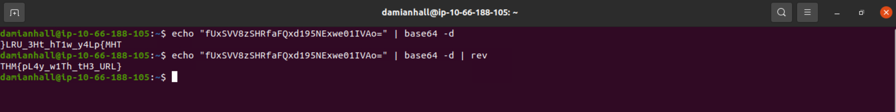
*Figure 12: Decoding the flag with base64 -d, then piping into rev*

```
echo "fUxSVV8zSHRfaFQxd195NExwe01IVAo=" | base64 -d | rev
```

This gave the flag:

```
THM{pL4y_w1Th_tH3_URL}
```

## Summary of findings

| Question | Answer |
|---|---|
| Employee who received the Quote email | William McClean |
| Adversary's sending address | `Accounts.Payable@groupmarketingonline.icu` |
| Root domain of the redirect URL (Zoe Duncan email) | `kennaroads.buzz` |
| Company impersonated on the fake login page | Microsoft |
| Name of the exposed archive | `Update365.zip` |
| SHA256 of the archive | `ba3c15267393419eb08c7b2652b8b6b39b406ef300ae8a18fee4d16b19ac9686` |
| Extra threat category on VirusTotal (besides phishing) | Trojan |
| Number of files inside the archive | 49 |
| User who submitted credentials more than once | `michael.ascot@swiftspend.finance` |
| Email address collecting stolen credentials | `m3npat@yandex.com` |
| Hidden flag in flag.txt | `THM{pL4y_w1Th_tH3_URL}` |

## Conclusion

This was a larger and more organised phishing campaign than a single email. The attacker sent out emails from one address, used both PDF and HTML attachments to lead victims to a fake Microsoft login page, and hosted that page on what looks like a hacked legitimate WordPress site. Because the attacker left their `/data` folder open to the public, I was able to download their own phishing kit, see the full list of stolen credentials in a plain text log, and find the email address where every new set of credentials was being sent. At least one employee, `michael.ascot@swiftspend.finance`, had their credentials captured more than once.

## What I would recommend

- Force a password reset for every account found in the exposed log file, and check those accounts for suspicious activity such as mailbox rules, forwarding, or sign-ins from unusual locations.
- Block the sender address and the `kennaroads.buzz` domain at the email gateway and web proxy.
- Report the compromised `kennaroads.buzz` site to its host so the phishing kit and log file can be taken down.
- Turn on multi-factor authentication for all accounts, so a stolen password alone is not enough to log in.
- Keep training staff to check sender addresses and links before entering credentials, and keep encouraging them to report suspicious emails quickly, since that is what started this investigation.

## What I learned

- How a phishing kit is put together, and how scripts like `submit.php` collect and forward stolen credentials.
- That attackers sometimes host phishing pages on hacked legitimate websites instead of new domains.
- How to find and use exposed directories and log files as extra evidence during an investigation.
- How to use VirusTotal to check an archive file, not just a single file, and read its threat categories.
- How to decode encoded data with base64 and `rev` on the command line.
